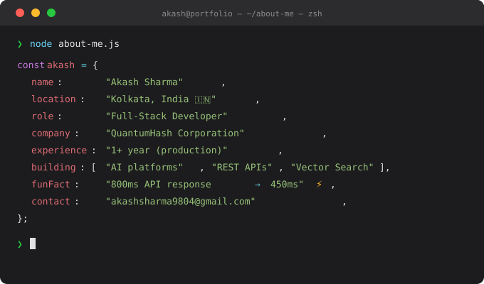

<div align="center">
  
</div>

<div align="center">
  <a href="https://git.io/typing-svg">
    
  </a>
</div>

<br/>

<div align="center">
  <a href="https://akash-sharma-9804.github.io" target="_blank">
    
  </a>
  <a href="https://linkedin.com/in/akash-sharma-9804" target="_blank">
    
  </a>
  <a href="mailto:akashsharma9804@gmail.com">
    
  </a>
  
</div>

---

##  About Me

<div align="center">
  
</div>

---

## 🛠️ Tech Stack & Tools

<div align="center">

**🎨 Frontend**


**⚙️ Backend**


**🗄️ Databases**


**🤖 AI & Integrations**


**🚀 DevOps & Tools**


</div>

---

## 🚀 Featured Projects

### 🤖 AI-Powered Applications

<table>
  <tr>
    <td width="50%">
      <h3 align="center">🧠 QhashAI — Conversational Platform</h3>
      <div align="center">
        <a href="https://github.com/Akash-Sharma-9804/qhashai">
          
        </a>
        <p>
          AI conversational platform with semantic memory.<br/>
          <b>5,000+ AI queries</b> · 40% better context accuracy<br/>
          
          
          
          
        </p>
      </div>
    </td>
    <td width="50%">
      <h3 align="center">🎤 OfficeMoM — Meeting Automation</h3>
      <div align="center">
        <a href="https://github.com/Akash-Sharma-9804">
          
        </a>
        <p>
          AI meeting platform — auto-generates Minutes of Meeting.<br/>
          <b>90% transcription accuracy</b> · 70% less manual effort<br/>
          
          
          
          
        </p>
      </div>
    </td>
  </tr>
  <tr>
    <td width="50%">
      <h3 align="center">📝 ASES — AI Assessment System</h3>
      <div align="center">
        <a href="https://github.com/Akash-Sharma-9804/ASES-system">
          
        </a>
        <p>
          Scalable online assessment platform with AI-generated questions & automated scoring.<br/>
          
          
          
        </p>
      </div>
    </td>
    <td width="50%">
      <h3 align="center">🎓 QuantumEdu — AI E-Learning</h3>
      <div align="center">
        <a href="https://github.com/Akash-Sharma-9804/quantumFrontend">
          
        </a>
        <p>
          AI tutoring platform for Class 5–12 with personalized learning & doubt solving.<br/>
          
          
          
          
        </p>
      </div>
    </td>
  </tr>
</table>

---

### 🌐 Web Applications & Clones

<table>
  <tr>
    <td width="33%">
      <h3 align="center">🍕 Zomato Clone</h3>
      <div align="center">
        <a href="https://github.com/Akash-Sharma-9804/Zomato-clone-React">
          
        </a>
        <p>Full-featured food delivery app clone with React<br/>
          
          
        </p>
      </div>
    </td>
    <td width="33%">
      <h3 align="center">🎬 Netflix Clone</h3>
      <div align="center">
        <a href="https://github.com/Akash-Sharma-9804/Netflix-clone">
          
        </a>
        <p>Netflix UI clone with movie browsing<br/>
          
          
        </p>
      </div>
    </td>
    <td width="33%">
      <h3 align="center">🌤️ Weather App</h3>
      <div align="center">
        <a href="https://github.com/Akash-Sharma-9804/Weather-app">
          
        </a>
        <p>Real-time weather app with live API data<br/>
          
          
        </p>
      </div>
    </td>
  </tr>
  <tr>
    <td width="33%">
      <h3 align="center">🎤 Voice to Text</h3>
      <div align="center">
        <a href="https://github.com/Akash-Sharma-9804/voice-to-text">
          
        </a>
        <p>Browser-based speech-to-text converter<br/>
          
          
        </p>
      </div>
    </td>
    <td width="33%">
      <h3 align="center">💰 Expense Tracker</h3>
      <div align="center">
        <a href="https://github.com/Akash-Sharma-9804/Expense-tracker">
          
        </a>
        <p>Track income & expenses with visual breakdown<br/>
          
          
        </p>
      </div>
    </td>
    <td width="33%">
      <h3 align="center">✅ To-Do List</h3>
      <div align="center">
        <a href="https://github.com/Akash-Sharma-9804/To-do-list">
          
        </a>
        <p>Clean task management app with CRUD ops<br/>
          
          
        </p>
      </div>
    </td>
  </tr>
  <tr>
    <td width="33%">
      <h3 align="center">✂️ Stone Paper Scissors</h3>
      <div align="center">
        <a href="https://github.com/Akash-Sharma-9804/Stone-paper">
          
        </a>
        <p>Interactive game with score tracking<br/>
          
        </p>
      </div>
    </td>
    <td width="33%">
      <h3 align="center">🌐 Portfolio Website</h3>
      <div align="center">
        <a href="https://github.com/Akash-Sharma-9804/portfolio">
          
        </a>
        <p>Personal portfolio — live on GitHub Pages<br/>
          
          
        </p>
      </div>
    </td>
    <td width="33%">
      <h3 align="center">🛒 E-Commerce Microservices</h3>
      <div align="center">
        <a href="https://github.com/Akash-Sharma-9804/akash-sharma-9804.github.io">
          
        </a>
        <p>Scalable e-commerce with microservices & event-driven architecture<br/>
          
          
        </p>
      </div>
    </td>
  </tr>
</table>

---

## 📊 GitHub Stats

<div align="center">
  
  
</div>

<div align="center">
  
</div>

<div align="center">
  
</div>

---

## 🏆 Achievements & Trophies

<div align="center">
  
</div>

---

## ⚡ Impact in Numbers

<div align="center">

| Metric | Value |
|--------|-------|
| 🏗️ RESTful API endpoints built | **50+** |
| ⚛️ Reusable React components | **40+** |
| ⚡ API response time reduced | **800ms → 450ms** |
| 🗄️ DB performance improved | **35% faster** |
| 🤖 AI-driven requests handled | **10,000+** |
| 👥 Users across production apps | **1,000+** |
| 🚀 Production apps deployed | **4** |
| 🔄 Lighthouse score achieved | **90+** |

</div>

---

## 🌱 Currently Exploring

<div align="center">

```
🔍  RAG Pipelines          →  Advanced retrieval-augmented generation patterns
🧠  Vector Databases       →  Pinecone, Weaviate, pgvector optimizations  
☁️  Cloud Infrastructure   →  AWS, containerization with Docker
📐  System Design          →  Scaling microservices architectures
🔐  Auth & Security        →  JWT, OAuth2, role-based access control
```

</div>

---

## 📫 Let's Connect & Build Together

<div align="center">

> 💡 *Open to exciting projects, collaborations, and full-time opportunities!*

<a href="mailto:akashsharma9804@gmail.com">
  
</a>
<a href="https://wa.me/916291723554">
  
</a>
<a href="https://linkedin.com/in/akash-sharma-9804">
  
</a>
<a href="https://akash-sharma-9804.github.io">
  
</a>

</div>

<br/>

---

## 🐍 Contribution Snake

<div align="center">
  
</div>

---

<div align="center">
  
</div>
